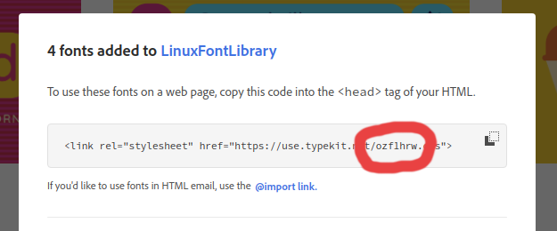
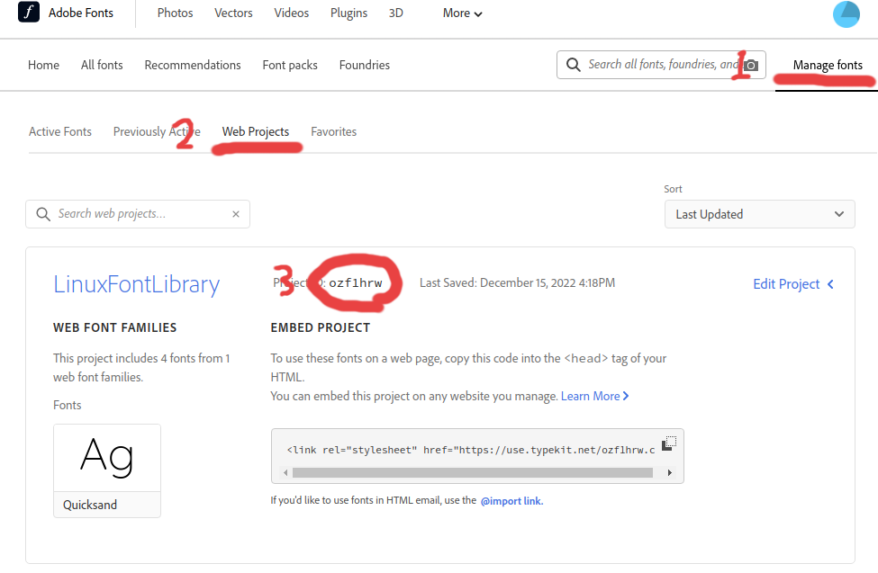

# Typekit Sync
This is an unofficial tool for downloading fonts from Adobe Fonts (Typekit). You must have a valid adobe account to use this tool as it takes advantage of the Web Projects feature.

# Usage
### Sync all projects
To sync all projects just run:
```
tksync
```

### Add new Typekit Project
To add a new project to be tracked by tksync, first [create a new Web Project in Adobe Fonts](#how-to-create-a-new-web-project-in-adobe-fonts).

Then run use the tksync add command:
```
tksync add [OPTIONS] <ID> <NAME> <PATH>

Arguments:
  <ID>    Id of the typekit project
  <NAME>  Name of typekit project
  <PATH>  Path to download project fonts to

Options:
  -r, --replace  Overwrite existing project id if it exists
```

### How to create a new Web Project in Adobe Fonts
Go to [Adobe Fonts](https://fonts.adobe.com) and search for a font that you want.

Once you find one, click on the font, and click the '**</> Add to Web Project**' button.


Then click on the dropdown for projects, and either add the font to an existing project or create a new project.


Once added, your project id is the also the filename for the corresponding web project css file.



The project ID can also be accessed by clicking on '**Manage fonts**' in the top right, and then clicking '**Web Projects**'.



Once a new project ID is created, you may add that project to `tksync` using the following:
```
tksync add ozf1hrw LinuxFontLibrary /usr/share/fonts
```

The name and download directory are not restricted by the project. Just choose the best location for your fonts to be downloaded to. For me, that was `/usr/share/fonts`

> Note: if you have directories that require special privilages like `/usr/share/fonts`, you will have to run the sync commmand with sudo `sudo tksync`.

# Installation
### Arch Linux
```
sudo pacman -S --needed base-devel
git clone https://aur.archlinux.org/tksync.git
cd tksync
makepkg -si
```
### Arch Linux using [paru](https://github.com/Morganamilo/paru)
```
paru -S tksync
```
### Manual Install
Install the `rust` package manager [cargo](https://doc.rust-lang.org/cargo/getting-started/installation.html)

Then build the binary
```
git clone https://github.com/rhedgeco/tksync.git
cd tksync
cargo build --release
```

Next, copy the binary to a place of your choosing (probably somewhere in your shells PATH):
```
cp ./target/release/tksync /usr/bin/tksync
```

## [MIT LICENSE](LICENSE.md)